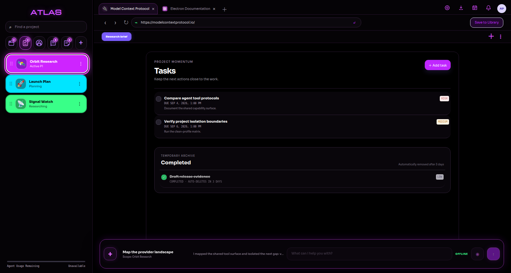
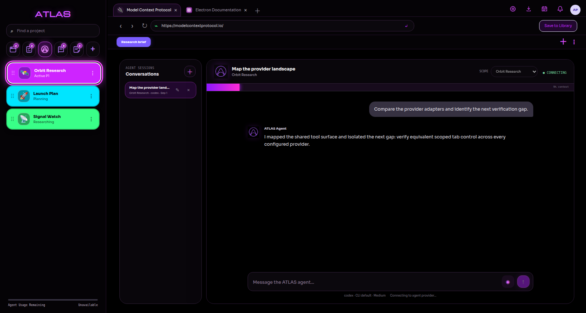
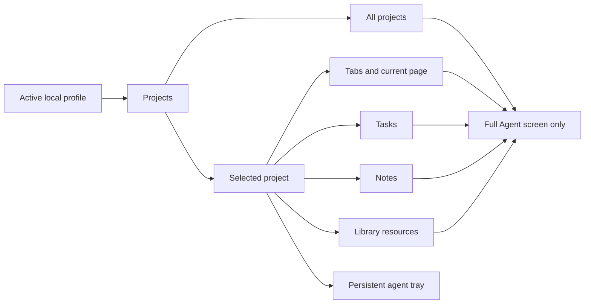
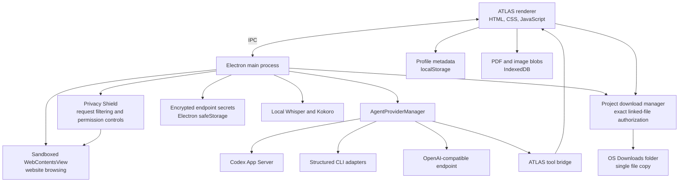

<div align="center">
  

  # ATLAS

  **A project-centered browser built for agentic research, durable context, and focused execution.**

  Keep websites, tasks, notes, documents, bookmarks, and AI conversations inside the project where they belong.

  [](https://github.com/SketchOTP/ATLAS-Browser/releases)
  [](https://github.com/SketchOTP/ATLAS-Browser/actions/workflows/ci.yml)
  [](https://www.electronjs.org/)
  [](LICENSE)

  [Download](https://github.com/SketchOTP/ATLAS-Browser/releases) · [Features](#features) · [Quick start](#quick-start) · [Architecture](docs/ARCHITECTURE.md) · [Security](SECURITY.md) · [Contributing](CONTRIBUTING.md)
</div>

---

<p align="center">
  
</p>

<details>
<summary><strong>Agent workspace</strong></summary>
<br />

</details>

## What is ATLAS?

ATLAS is an Electron desktop browser designed around projects instead of a single undifferentiated history. Each project has its own live website tabs, bookmark bar, task list, notes, resource library, and agent context.

The built-in agent can research in browser tabs, read the current page, inspect project context, create and update tasks, work with notes, and use saved library resources. Agent sessions can be restricted to one project or, from the full Agent screen, allowed to work across every project in the active profile.

ATLAS is local-first and provider-flexible. Codex CLI with ChatGPT OAuth is the default integration, while the provider layer can also be configured for Claude Code, Antigravity CLI, Cursor Agent, OpenClaw, Hermes Agent, custom structured CLIs, or an OpenAI-compatible endpoint.

> [!IMPORTANT]
> ATLAS `0.1.x` is a public preview. Release artifacts are automated and content-audited, but they are not yet code-signed or notarized. Back up important information before upgrading; stable migration guarantees and automatic updates are not available yet.

The public repository is self-contained. Start with the [architecture](docs/ARCHITECTURE.md), [privacy model](docs/PRIVACY.md), [security policy](SECURITY.md), and [release process](docs/RELEASING.md) for implementation and trust-boundary details.

## Why ATLAS?

Traditional browsers remember where you went. ATLAS is intended to remember **why you went there**, which project it supports, what you saved, and what should happen next.

- **Project isolation** keeps unrelated research and agent context separate.
- **Durable working context** joins tabs, tasks, notes, documents, images, and PDFs.
- **Agent control** lets a configured CLI operate the workspace through explicit ATLAS tools.
- **Provider choice** avoids tying the browser to one model vendor or one authentication method.
- **Local profiles** provide separate environments without mixing project data.
- **Hands-free operation** combines voice activity detection, local speech-to-text, and local text-to-speech.

## Features

### Project workspaces

- Custom project display name, status, neon color, uploaded image, or emoji
- Drag-and-drop project ordering and a resizable project sidebar
- Project-specific tabs, bookmarks, tasks, notes, library items, and agent context
- Separate local profiles identified by display name and email
- Profile-scoped persistent website sessions: Google and other OAuth sign-ins are reusable across that profile's projects, tabs, and sign-in popups, but cookies and site storage are never shared with another ATLAS profile
- Persistent state restored when ATLAS is reopened or profiles are switched

### Native website browsing

- Real websites rendered in an isolated Electron `WebContentsView`
- Visible sandboxed website popups that preserve opener state and the shared website session for supported OAuth sign-in flows
- Hard profile/project/tab browser-history isolation: every open tab owns a separately keyed Electron website view and Back/Forward stack, inactive views cannot receive browser or agent commands, late navigation metadata is discarded outside its originating context, and removed tabs/projects are destroyed rather than reassigned
- Project-scoped website tabs with searchable emoji icons or automatic favicons
- Back, forward, reload, address/search input, and configurable new-tab page
- Project bookmark bars with custom names and neon colors
- Global bookmarks that automatically appear in existing and future projects
- Project-scoped downloads with a circular live-progress indicator, completion bubble, history, and one-click file opening
- Automatic linking of completed downloads into the active project Library without duplicating file contents
- Right-click **Send to Library** for highlighted webpage text
- Modern-site compatibility handling, including a browser-compatible user agent
- Agent-driven inspection, native clicking, text entry, key input, and scrolling in the active website tab
- Per-profile Privacy Shield with Off, Balanced, and Strict modes
- One-click clearing of website cookies, cache, and stored site data

### Project library

- Save the current page directly from the browser toolbar
- Store titled URLs, editable text documents, PDFs, images, and exact links to downloaded files
- Open saved URLs in new ATLAS tabs
- View PDFs and images inside ATLAS
- Keep manually uploaded binary resources in IndexedDB while downloaded resources remain single-copy files in the operating system Downloads folder
- Make project resources available to the selected agent scope

### Downloads and linked Library files

ATLAS captures Electron's native download lifecycle for the active project. While a file is downloading, the ring around the Downloads icon fills from empty to complete. On completion, the ring briefly remains full and ATLAS opens a short-lived completion bubble. Clicking the icon at any time opens the current project's download history; dismissing a history row is only an acknowledgement and never deletes the disk file or its Library entry.

Completed downloads remain in the operating system Downloads folder. The project Library stores an exact link and metadata—filename, MIME type, source URL, size, and completion time—rather than a second copy. Removing the Library entry does not delete the original download.

Linked-file access is project-capability scoped. The agent context never receives a Downloads path, ATLAS exposes no folder-listing tool, and a Library read is authorized against the exact active-profile, project, and resource identifiers. Text, PDF, and image links can be read by the scoped agent through that resource; neighboring files in Downloads are not reachable through the Library tool.

### Tasks and notes

- Editable task title, priority, and due date
- Desktop notifications and an in-app unread notification center
- Completed-task archive with automatic removal after three days
- Rich-text notes with font, size, bold, italic, underline, lists, links, and color
- Edit or delete existing notes and tasks

### Agent workspace

- Full ChatGPT-style conversation workspace with saved and renameable sessions
- Per-session project scope enforced by the ATLAS host
- Persistent bottom agent tray scoped to the currently selected project
- Automatic conversation titles derived from the first request
- Context usage tracking and automatic compaction near a configurable threshold
- Provider-specific model, executable, authentication, usage, and reasoning settings
- Shared ATLAS tool surface for browser tabs, tasks, notes, and library resources
- Provider and CLI-owned MCP compatibility

### Local conversation mode

- Voice activity detection for natural hands-free turns
- Local Whisper transcription with `tiny.en`, `base.en`, or `small.en`
- Local Kokoro-82M speech generation
- Multiple American and British voices with adjustable speaking speed
- Continuous listen → act → speak → listen interaction loop

### Guided onboarding

A clean profile opens an interactive walkthrough covering projects, tabs, emoji and favicon controls, bookmarks, research capture, tasks, the library, notes, the Agent screen, project scope, voice mode, and Settings. The walkthrough can be replayed later without resetting any preferences.

## Quick start

### Install a release

Download the latest build from [GitHub Releases](https://github.com/SketchOTP/ATLAS-Browser/releases).

Linux releases include an AppImage and Debian package. Make an AppImage executable before opening it:

```bash
chmod +x ATLAS-*.AppImage
./ATLAS-*.AppImage
```

Install a Debian package with:

```bash
sudo apt install ./ATLAS-*.deb
```

Windows releases include an interactive NSIS installer and a portable executable. Preview builds are unsigned, so the operating system may display an unknown-publisher warning. Verify the file against `SHA256SUMS.txt` attached to the same release before running it.

Release packages contain no profile records, maintainer projects, cookies, OAuth tokens, API keys, browsing history, downloads, or personal settings. On first launch, ATLAS creates an empty generic local profile in the operating system's application-data directory and starts the walkthrough.

### Run from source

### Requirements

- Git
- Node.js 22.12 or newer
- pnpm 11.19 or newer
- A supported agent CLI if agent functionality is desired
- Python 3.11+ and FFmpeg for optional local voice features

```bash
git clone https://github.com/SketchOTP/ATLAS-Browser.git
cd ATLAS-Browser
pnpm install --frozen-lockfile
pnpm start
```

### Linux launcher

The included launcher discovers a bundled Codex runtime when available and otherwise uses the Node.js installation on `PATH`:

```bash
chmod +x run-atlas-browser.sh
./run-atlas-browser.sh
```

If an older Linux desktop shortcut reports that the launcher is not on `PATH`, refresh it so the command is run through Bash:

```ini
Exec=/usr/bin/env bash /absolute/path/to/ATLAS-Browser/run-atlas-browser.sh %U
```

ATLAS saves website downloads in the operating system Downloads folder. For isolated testing, that destination can be overridden with `ATLAS_DOWNLOADS_DIR=/absolute/path`.

### Web-only preview

```bash
pnpm run serve
```

Then open <http://localhost:48173>.

The preview is useful for UI development, but it cannot provide the full desktop experience. Native website embedding, desktop menus, encrypted secrets, CLI processes, notifications, PDF extraction, and local voice require Electron.

## Configure Codex OAuth

Codex is the default ATLAS provider. Authenticate with the Codex CLI itself:

```bash
codex login
```

Then launch ATLAS and open **Settings → Agent provider**. Keep **Codex CLI** selected and use **Test connection**. ATLAS communicates with Codex through its native App Server and reuses the CLI's ChatGPT OAuth session. ATLAS does not copy or store the OAuth token.

The default ATLAS configuration uses:

| Setting | Default |
| --- | --- |
| Provider | Codex CLI |
| Transport | Codex App Server over stdio |
| Model | Codex CLI account default; configurable in Settings |
| Reasoning effort | Medium |
| Authentication | ChatGPT OAuth managed by Codex CLI |
| Usage meter | Native Codex account rate-limit data |

## Agent providers

Open **Settings → Agent provider** to choose and configure an adapter. CLI providers own their credentials; ATLAS launches the provider's login or onboarding command in a terminal and never imports its OAuth token.

| Provider | ATLAS transport | Authentication | Usage remaining | Tools / MCP |
| --- | --- | --- | --- | --- |
| **Codex CLI** | Native Codex App Server | `codex login` / ChatGPT OAuth | Native account data | Native ATLAS tools; CLI MCP support |
| **Claude Code** | Structured one-shot CLI | Claude CLI sign-in | Manual or custom command | Portable ATLAS tool loop; CLI MCP config |
| **Antigravity CLI** | Headless JSON CLI | Interactive `agy` session | Configurable CLI command | Portable ATLAS tool loop; CLI MCP capability |
| **Cursor Agent** | Headless JSON CLI | `cursor-agent login` | Manual or custom command | Portable ATLAS tool loop; CLI MCP capability |
| **OpenClaw** | `openclaw agent exec` JSON | `openclaw onboard` | Manual or custom command | Portable ATLAS tools; OpenClaw bridge/MCP capability |
| **Hermes Agent** | Headless CLI | Hermes-owned setup | Manual or custom command | Portable ATLAS tool loop |
| **Custom CLI** | User-defined executable and arguments | User-defined | Manual or custom command | Portable ATLAS tool loop |
| **OpenAI-compatible URL** | `/chat/completions` with function tools | Encrypted API key | Manual | Native function-tool requests |

### Provider placeholders

Advanced CLI arguments accept these placeholders, each passed as a distinct process argument without shell evaluation:

| Placeholder | Value |
| --- | --- |
| `{prompt}` | ATLAS agent instructions, context, history, and the current request |
| `{cwd}` | ATLAS application working directory |
| `{model}` | Configured model name |
| `{effort}` | Configured reasoning effort |

Provider CLIs evolve independently. If a provider changes its headless flags or output format, update the executable and argument list in the advanced provider settings.

### Usage meter modes

The **Agent Usage Remaining** meter supports four modes:

1. **Provider-native** — used by Codex App Server.
2. **CLI command** — runs a configured provider command and extracts percentage output.
3. **Manual percentage** — useful when the provider exposes no machine-readable quota endpoint.
4. **Unavailable** — hides inaccurate quota assumptions and clearly reports that no source exists.

## Optional local voice setup

ATLAS expects a Python environment at `.venv` by default. You can override it with `ATLAS_PYTHON`.

```bash
python3 -m venv .venv
source .venv/bin/activate
python -m pip install --upgrade pip
python -m pip install openai-whisper kokoro numpy soundfile
```

Whisper also requires FFmpeg. On Debian or Ubuntu:

```bash
sudo apt install ffmpeg libsndfile1
```

Models and voice assets may be downloaded by their respective Python packages on first use. Conversation mode can still be left disabled when the optional voice runtime is not installed.

## How project scope works



- The bottom tray is always restricted to the project currently open in the sidebar.
- **All projects** scope is available only in the full Agent screen.
- Once a conversation contains messages, its scope is locked to prevent accidental context expansion.
- The renderer supplies only the permitted project snapshot, and every mutating ATLAS tool rechecks the project boundary before acting.

## Architecture

The detailed component and trust-boundary guide is in [docs/ARCHITECTURE.md](docs/ARCHITECTURE.md).



### Repository layout

```text
ATLAS-Browser/
├── electron-main.mjs       # Window lifecycle, native website view, IPC, secure secrets
├── preload.cjs             # Context-isolated renderer API
├── agent-providers.mjs     # Provider catalog and portable adapter implementations
├── codex-agent.mjs         # Native Codex App Server integration and ATLAS tools
├── browser-control.mjs     # Inspected-element refs and native website input controls
├── download-manager.mjs    # Native download lifecycle and exact Library-file capabilities
├── local-voice.mjs         # Local Whisper transcription
├── local-tts.mjs           # Kokoro worker lifecycle and voice catalog
├── privacy-shield.mjs      # Website tracking protection and data clearing
├── library-reader.mjs      # Local PDF extraction
├── server.mjs              # Local static UI server
├── public/
│   ├── index.html          # Application shell and dialogs
│   ├── app.js              # Workspace state and UI behavior
│   ├── styles.css          # High-contrast ATLAS design system
│   └── assets/             # Logos and application icons
├── voice/
│   └── kokoro_worker.py    # Local TTS worker
└── run-atlas-browser.sh    # Portable Linux launcher
```

## Agent tool surface

The current tool bridge allows an agent to:

- Read the permitted ATLAS project context
- Read the visible text, URL, and title of the current page
- Open, navigate, close, or bulk-close exact project tabs while preserving tabs the user asked to keep
- Inspect visible interactive page elements and receive short-lived element references
- Click inspected elements using native Chromium mouse input
- Type into inspected fields, choose select options, press common keys, and scroll the page
- Create, edit, complete, or delete tasks
- Save the current page or add a URL to the library
- Read text, PDF, and image library resources
- Read an exact downloaded file only when it is linked to an allowed project Library resource
- Rewrite editable text resources
- Create, update, or delete project notes

Website text and saved content are treated as untrusted data. The host validates project scope for every tool request, and destructive tools are instructed to run only after an explicit user request. Downloaded-file tools accept project and resource identifiers, not arbitrary paths, and do not expose directory enumeration.

Browser interaction tools are included in the shared `atlasDynamicTools` catalog, so they are exposed to Codex App Server, structured CLI adapters, and OpenAI-compatible function-tool providers. Every interaction requires the active project and tab identifiers. Element references expire when the agent inspects again and should be refreshed after navigation or a major page update. ATLAS does not expose an arbitrary JavaScript-evaluation tool to providers.

The inspector currently targets the top-level website document. It reports the number of embedded iframes, but elements inside cross-origin frames may not be directly controllable until frame-aware inspection is added.

## Privacy Shield

Privacy Shield is configured per ATLAS profile under **Settings → Privacy shield**. A mode change is applied and saved to the active profile immediately, so it survives closing ATLAS without requiring the main Settings save button. Switching profiles restores that profile's saved mode. New profiles use **Balanced** mode by default.

| Mode | Behavior |
| --- | --- |
| **Off** | Uses the compatibility user agent without tracker blocking, tracking-parameter cleanup, or privacy request headers. Sandboxing and restrictive website permissions remain enabled. |
| **Balanced** | Blocks common advertising and analytics hosts, removes common marketing parameters from top-level links, sends Do Not Track and Global Privacy Control signals, withholds high-entropy client hints, and declines sensitive website permissions. |
| **Strict** | Adds known telemetry hosts, uses a reduced browser user agent that preserves only the real operating-system family for sign-in compatibility, withholds detailed browser-brand and platform hints, and normalizes language headers. This can trigger additional verification or break some sites. |

The Privacy Shield card displays the number of tracker requests blocked and navigation links cleaned during the current app session. **Clear cookies and website data** clears ATLAS website cookies, cache, and site storage and signs the browser out of websites. It does not remove ATLAS profiles, projects, tabs, bookmarks, tasks, notes, conversations, or Library resources.

Privacy Shield reduces routine tracking; it does not make a logged-in account anonymous. A website can still know the account you used, your public IP address, login time, cookies required for authentication, and signals inferred from the network, screen, fonts, graphics stack, or behavior. Strict mode does not attempt to falsify every JavaScript-visible property. Hiding an IP address requires a separate network privacy layer, and signing into a personal account still identifies that account.

## Privacy and data

ATLAS does not include personal projects, profiles, tokens, or API keys in a fresh clone.

| Data | Storage |
| --- | --- |
| Profiles, projects, tabs, bookmarks, tasks, notes, conversations | Electron renderer local storage |
| Uploaded PDFs and images | IndexedDB |
| Website downloads | Operating-system Downloads folder; Library stores only an exact project-scoped link and metadata |
| OpenAI-compatible endpoint keys | Electron `safeStorage`, encrypted by the operating system |
| Codex, Claude, Cursor, and other CLI credentials | Owned by the corresponding CLI, outside ATLAS |
| Temporary microphone recordings | Operating-system temporary directory, deleted after transcription |

Default Electron profile locations are typically:

- Linux: `~/.config/atlas-browser`
- macOS: `~/Library/Application Support/atlas-browser`
- Windows: `%APPDATA%\atlas-browser`

> [!CAUTION]
> Local-first does not mean offline. Websites receive ordinary browser requests, and agent providers receive the prompt and the project context allowed by the selected scope. Review the privacy policy and data handling of any provider you configure.

The repository ignores virtual environments, dependencies, local logs, runtime output, `.env` files, encrypted secret files, and test workspaces. Always inspect staged files and run a secret scanner before publishing a fork.

## Environment variables

| Variable | Purpose | Default |
| --- | --- | --- |
| `ATLAS_BROWSER_PORT` | Local shell server port | `48173` |
| `ATLAS_CODEX_BIN` | Explicit path to the Codex executable | Auto-detected |
| `ATLAS_DOWNLOADS_DIR` | Override the website download destination, useful for isolated testing | OS Downloads folder |
| `ATLAS_PYTHON` | Python executable used for Whisper and Kokoro | `.venv/bin/python3` or system Python |
| `ATLAS_USER_DATA_DIR` | Override Electron profile directory, useful for testing | OS app-data directory |

## Development

Install dependencies and run the full release gate:

```bash
pnpm install --frozen-lockfile
pnpm run release:check
```

Start the Electron application:

```bash
pnpm start
```

Start only the UI server:

```bash
pnpm run serve
```

When changing agent providers, test both a clean temporary profile and an existing profile. Provider changes must not rewrite existing project data, copy OAuth credentials, or attempt to resume a conversation through a different provider.

## Troubleshooting

<details>
<summary><strong>Agent Usage Remaining shows Unavailable</strong></summary>

- Confirm the selected provider is signed in.
- For Codex, run `codex login status`, then use **Test connection** in ATLAS Settings.
- For another CLI, configure a usage command or a manual percentage.
- Some providers do not expose subscription quotas programmatically; in that case Unavailable is intentional.

</details>

<details>
<summary><strong>A linked Library download will not open</strong></summary>

- Confirm the original file still exists in the operating system Downloads folder.
- The Library entry is a link, not a copy; moving or deleting the original breaks the link.
- Re-download the file from its source to create a new linked Library entry.

</details>

<details>
<summary><strong>The configured CLI is not found</strong></summary>

- Run the CLI's version command in a terminal.
- Make sure its installation directory is on `PATH` before launching ATLAS.
- Alternatively, enter the absolute executable path in **Settings → Agent provider**.
- Use **Test connection** before starting a new conversation.

</details>

<details>
<summary><strong>A website is blank or does not finish loading</strong></summary>

- Reload the tab and confirm the machine has network access.
- If Privacy Shield is set to Strict, temporarily use Balanced or Off for that site and reload it.
- Review the terminal output for `SITE_LOAD_FAILED`, `SITE_RENDERER_GONE`, or `SITE_CONSOLE_*` diagnostics.
- Some authentication flows block embedded or automated browser surfaces.
- Keep Electron current; modern websites can depend on recent Chromium behavior.

</details>

<details>
<summary><strong>Local transcription fails</strong></summary>

- Confirm `ATLAS_PYTHON` points to the environment containing `openai-whisper`.
- Confirm FFmpeg is installed and available on `PATH`.
- Start with the `tiny.en` model to validate the pipeline before selecting a larger model.

</details>

<details>
<summary><strong>Local speech generation is silent</strong></summary>

- Confirm the selected Python environment contains `kokoro`, `numpy`, and `soundfile`.
- Wait for the first model download to finish.
- Use **Preview selected voice** in Settings and inspect the terminal for `KOKORO_TTS` messages.

</details>

## Project status

ATLAS `0.1.x` is a functional, versioned public preview with automated Linux and Windows packaging, clean-profile smoke testing, package-content auditing, and focused isolation tests. It is not yet production-certified: installers are unsigned, automatic updates and profile backup/export are not implemented, accessibility and broader platform validation remain in progress, and no independent security audit has been completed. See the [changelog](CHANGELOG.md) for the precise release surface.

## Contributing

Contributions and issue reports are welcome. Read [CONTRIBUTING.md](CONTRIBUTING.md) for environment setup, trust-boundary rules, required checks, and pull-request expectations.

## Security

Do not report credentials, private project data, or authentication tokens in a public issue. Follow [SECURITY.md](SECURITY.md) and use GitHub private vulnerability reporting.

## License

ATLAS Browser is released under the [MIT License](LICENSE). You may use, modify, distribute, and build on the project subject to the terms in that file.

---

<div align="center">
  <strong>ATLAS</strong><br />
  Browse with purpose. Keep the context. Let the agent work where the project lives.
</div>
