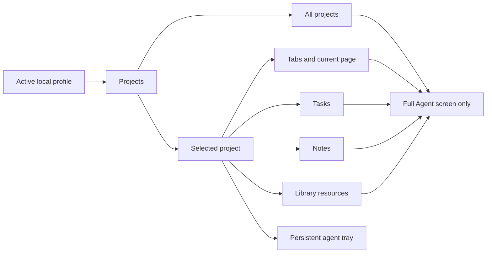
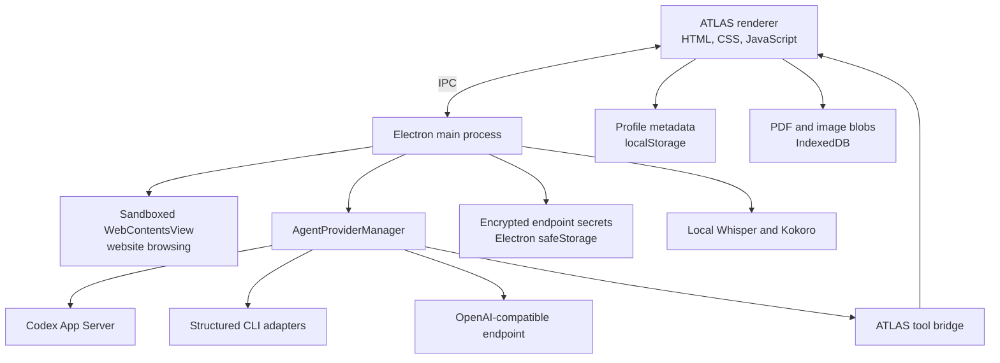

<div align="center">
  

  # ATLAS Browser

  **A project-centered browser built for agentic research, durable context, and focused execution.**

  Keep websites, tasks, notes, documents, bookmarks, and AI conversations inside the project where they belong.

  [](#project-status)
  [](https://www.electronjs.org/)
  [](https://nodejs.org/)
  [](#privacy-and-data)

  [Features](#features) · [Quick start](#quick-start) · [Agent providers](#agent-providers) · [Architecture](#architecture) · [Contributing](#contributing)
</div>

---

## What is ATLAS?

ATLAS is an Electron desktop browser designed around projects instead of a single undifferentiated history. Each project has its own live website tabs, bookmark bar, task list, notes, resource library, and agent context.

The built-in agent can research in browser tabs, read the current page, inspect project context, create and update tasks, work with notes, and use saved library resources. Agent sessions can be restricted to one project or, from the full Agent screen, allowed to work across every project in the active profile.

ATLAS is local-first and provider-flexible. Codex CLI with ChatGPT OAuth is the default integration, while the provider layer can also be configured for Claude Code, Antigravity CLI, Cursor Agent, OpenClaw, Hermes Agent, custom structured CLIs, or an OpenAI-compatible endpoint.

> [!IMPORTANT]
> ATLAS is currently alpha software. It is suitable for development and personal experimentation, but it does not yet ship signed installers, automatic updates, cloud synchronization, or a stable data-migration guarantee.

## Why ATLAS?

Traditional browsers remember where you went. ATLAS is intended to remember **why you went there**, which project it supports, what you saved, and what should happen next.

- **Project isolation** keeps unrelated research and agent context separate.
- **Durable working context** joins tabs, tasks, notes, documents, images, and PDFs.
- **Agent control** lets a configured CLI operate the workspace through explicit ATLAS tools.
- **Provider choice** avoids tying the browser to one model vendor or one authentication method.
- **Local profiles** provide separate environments without mixing project data.
- **Hands-free operation** combines voice activity detection, local speech-to-text, and local text-to-speech.

## Features

### Project workspaces

- Custom project display name, status, neon color, uploaded image, or emoji
- Drag-and-drop project ordering and a resizable project sidebar
- Project-specific tabs, bookmarks, tasks, notes, library items, and agent context
- Separate local profiles identified by display name and email
- Persistent state restored when ATLAS is reopened or profiles are switched

### Native website browsing

- Real websites rendered in an isolated Electron `WebContentsView`
- Project-scoped website tabs with searchable emoji icons or automatic favicons
- Back, forward, reload, address/search input, and configurable new-tab page
- Project bookmark bars with custom names and neon colors
- Global bookmarks that automatically appear in existing and future projects
- Right-click **Send to Library** for highlighted webpage text
- Modern-site compatibility handling, including a browser-compatible user agent

### Project library

- Save the current page directly from the browser toolbar
- Store titled URLs, editable text documents, PDFs, and images
- Open saved URLs in new ATLAS tabs
- View PDFs and images inside ATLAS
- Keep binary resources in IndexedDB and project metadata in the local profile
- Make project resources available to the selected agent scope

### Tasks and notes

- Editable task title, priority, and due date
- Desktop notifications and an in-app unread notification center
- Completed-task archive with automatic removal after three days
- Rich-text notes with font, size, bold, italic, underline, lists, links, and color
- Edit or delete existing notes and tasks

### Agent workspace

- Full ChatGPT-style conversation workspace with saved and renameable sessions
- Per-session project scope enforced by the ATLAS host
- Persistent bottom agent tray scoped to the currently selected project
- Automatic conversation titles derived from the first request
- Context usage tracking and automatic compaction near a configurable threshold
- Provider-specific model, executable, authentication, usage, and reasoning settings
- Shared ATLAS tool surface for browser tabs, tasks, notes, and library resources
- Provider and CLI-owned MCP compatibility

### Local conversation mode

- Voice activity detection for natural hands-free turns
- Local Whisper transcription with `tiny.en`, `base.en`, or `small.en`
- Local Kokoro-82M speech generation
- Multiple American and British voices with adjustable speaking speed
- Continuous listen → act → speak → listen interaction loop

### Guided onboarding

A clean profile opens an interactive walkthrough covering projects, tabs, emoji and favicon controls, bookmarks, research capture, tasks, the library, notes, the Agent screen, project scope, voice mode, and Settings. The walkthrough can be replayed later without resetting any preferences.

## Quick start

### Requirements

- Git
- Node.js 20 or newer
- npm or pnpm
- A supported agent CLI if agent functionality is desired
- Python 3.11+ and FFmpeg for optional local voice features

### Clone with SSH

```bash
git clone git@github.com:SketchOTP/ATLAS-Browser.git
cd ATLAS-Browser
npm install
npm start
```

If you prefer pnpm:

```bash
pnpm install
pnpm start
```

### Linux launcher

The included launcher discovers a bundled Codex runtime when available and otherwise uses the Node.js installation on `PATH`:

```bash
chmod +x run-atlas-browser.sh
./run-atlas-browser.sh
```

### Web-only preview

```bash
npm run serve
```

Then open <http://localhost:48173>.

The preview is useful for UI development, but it cannot provide the full desktop experience. Native website embedding, desktop menus, encrypted secrets, CLI processes, notifications, PDF extraction, and local voice require Electron.

## Configure Codex OAuth

Codex is the default ATLAS provider. Authenticate with the Codex CLI itself:

```bash
codex login
```

Then launch ATLAS and open **Settings → Agent provider**. Keep **Codex CLI** selected and use **Test connection**. ATLAS communicates with Codex through its native App Server and reuses the CLI's ChatGPT OAuth session. ATLAS does not copy or store the OAuth token.

The default ATLAS configuration uses:

| Setting | Default |
| --- | --- |
| Provider | Codex CLI |
| Transport | Codex App Server over stdio |
| Model | `gpt-5.6-luna` |
| Reasoning effort | Medium |
| Authentication | ChatGPT OAuth managed by Codex CLI |
| Usage meter | Native Codex account rate-limit data |

## Agent providers

Open **Settings → Agent provider** to choose and configure an adapter. CLI providers own their credentials; ATLAS launches the provider's login or onboarding command in a terminal and never imports its OAuth token.

| Provider | ATLAS transport | Authentication | Usage remaining | Tools / MCP |
| --- | --- | --- | --- | --- |
| **Codex CLI** | Native Codex App Server | `codex login` / ChatGPT OAuth | Native account data | Native ATLAS tools; CLI MCP support |
| **Claude Code** | Structured one-shot CLI | Claude CLI sign-in | Manual or custom command | Portable ATLAS tool loop; CLI MCP config |
| **Antigravity CLI** | Headless JSON CLI | Interactive `agy` session | Configurable CLI command | Portable ATLAS tool loop; CLI MCP capability |
| **Cursor Agent** | Headless JSON CLI | `cursor-agent login` | Manual or custom command | Portable ATLAS tool loop; CLI MCP capability |
| **OpenClaw** | `openclaw agent exec` JSON | `openclaw onboard` | Manual or custom command | Portable ATLAS tools; OpenClaw bridge/MCP capability |
| **Hermes Agent** | Headless CLI | Hermes-owned setup | Manual or custom command | Portable ATLAS tool loop |
| **Custom CLI** | User-defined executable and arguments | User-defined | Manual or custom command | Portable ATLAS tool loop |
| **OpenAI-compatible URL** | `/chat/completions` with function tools | Encrypted API key | Manual | Native function-tool requests |

### Provider placeholders

Advanced CLI arguments accept these placeholders, each passed as a distinct process argument without shell evaluation:

| Placeholder | Value |
| --- | --- |
| `{prompt}` | ATLAS agent instructions, context, history, and the current request |
| `{cwd}` | ATLAS application working directory |
| `{model}` | Configured model name |
| `{effort}` | Configured reasoning effort |

Provider CLIs evolve independently. If a provider changes its headless flags or output format, update the executable and argument list in the advanced provider settings.

### Usage meter modes

The **Agent Usage Remaining** meter supports four modes:

1. **Provider-native** — used by Codex App Server.
2. **CLI command** — runs a configured provider command and extracts percentage output.
3. **Manual percentage** — useful when the provider exposes no machine-readable quota endpoint.
4. **Unavailable** — hides inaccurate quota assumptions and clearly reports that no source exists.

## Optional local voice setup

ATLAS expects a Python environment at `.venv` by default. You can override it with `ATLAS_PYTHON`.

```bash
python3 -m venv .venv
source .venv/bin/activate
python -m pip install --upgrade pip
python -m pip install openai-whisper kokoro numpy soundfile
```

Whisper also requires FFmpeg. On Debian or Ubuntu:

```bash
sudo apt install ffmpeg libsndfile1
```

Models and voice assets may be downloaded by their respective Python packages on first use. Conversation mode can still be left disabled when the optional voice runtime is not installed.

## How project scope works



- The bottom tray is always restricted to the project currently open in the sidebar.
- **All projects** scope is available only in the full Agent screen.
- Once a conversation contains messages, its scope is locked to prevent accidental context expansion.
- The renderer supplies only the permitted project snapshot, and every mutating ATLAS tool rechecks the project boundary before acting.

## Architecture



### Repository layout

```text
ATLAS-Browser/
├── electron-main.mjs       # Window lifecycle, native website view, IPC, secure secrets
├── preload.cjs             # Context-isolated renderer API
├── agent-providers.mjs     # Provider catalog and portable adapter implementations
├── codex-agent.mjs         # Native Codex App Server integration and ATLAS tools
├── local-voice.mjs         # Local Whisper transcription
├── local-tts.mjs           # Kokoro worker lifecycle and voice catalog
├── library-reader.mjs      # Local PDF extraction
├── server.mjs              # Local static UI server
├── public/
│   ├── index.html          # Application shell and dialogs
│   ├── app.js              # Workspace state and UI behavior
│   ├── styles.css          # High-contrast ATLAS design system
│   └── assets/             # Logos and application icons
├── voice/
│   └── kokoro_worker.py    # Local TTS worker
└── run-atlas-browser.sh    # Portable Linux launcher
```

## Agent tool surface

The current tool bridge allows an agent to:

- Read the permitted ATLAS project context
- Read the visible text, URL, and title of the current page
- Open a new project tab or navigate an existing tab
- Create, edit, complete, or delete tasks
- Save the current page or add a URL to the library
- Read text, PDF, and image library resources
- Rewrite editable text resources
- Create, update, or delete project notes

Website text and saved content are treated as untrusted data. The host validates project scope for every tool request, and destructive tools are instructed to run only after an explicit user request.

## Privacy and data

ATLAS does not include personal projects, profiles, tokens, or API keys in a fresh clone.

| Data | Storage |
| --- | --- |
| Profiles, projects, tabs, bookmarks, tasks, notes, conversations | Electron renderer local storage |
| Uploaded PDFs and images | IndexedDB |
| OpenAI-compatible endpoint keys | Electron `safeStorage`, encrypted by the operating system |
| Codex, Claude, Cursor, and other CLI credentials | Owned by the corresponding CLI, outside ATLAS |
| Temporary microphone recordings | Operating-system temporary directory, deleted after transcription |

Default Electron profile locations are typically:

- Linux: `~/.config/atlas-browser`
- macOS: `~/Library/Application Support/atlas-browser`
- Windows: `%APPDATA%\atlas-browser`

> [!CAUTION]
> Local-first does not mean offline. Websites receive ordinary browser requests, and agent providers receive the prompt and the project context allowed by the selected scope. Review the privacy policy and data handling of any provider you configure.

The repository ignores virtual environments, dependencies, local logs, runtime output, `.env` files, encrypted secret files, and test workspaces. Always inspect staged files and run a secret scanner before publishing a fork.

## Environment variables

| Variable | Purpose | Default |
| --- | --- | --- |
| `ATLAS_BROWSER_PORT` | Local shell server port | `48173` |
| `ATLAS_CODEX_BIN` | Explicit path to the Codex executable | Auto-detected |
| `ATLAS_PYTHON` | Python executable used for Whisper and Kokoro | `.venv/bin/python3` or system Python |
| `ATLAS_USER_DATA_DIR` | Override Electron profile directory, useful for testing | OS app-data directory |

## Development

Install dependencies and run the syntax suite:

```bash
npm install
npm run check
```

Start the Electron application:

```bash
npm start
```

Start only the UI server:

```bash
npm run serve
```

When changing agent providers, test both a clean temporary profile and an existing profile. Provider changes must not rewrite existing project data, copy OAuth credentials, or attempt to resume a conversation through a different provider.

## Troubleshooting

<details>
<summary><strong>Agent Usage Remaining shows Unavailable</strong></summary>

- Confirm the selected provider is signed in.
- For Codex, run `codex login status`, then use **Test connection** in ATLAS Settings.
- For another CLI, configure a usage command or a manual percentage.
- Some providers do not expose subscription quotas programmatically; in that case Unavailable is intentional.

</details>

<details>
<summary><strong>The configured CLI is not found</strong></summary>

- Run the CLI's version command in a terminal.
- Make sure its installation directory is on `PATH` before launching ATLAS.
- Alternatively, enter the absolute executable path in **Settings → Agent provider**.
- Use **Test connection** before starting a new conversation.

</details>

<details>
<summary><strong>A website is blank or does not finish loading</strong></summary>

- Reload the tab and confirm the machine has network access.
- Review the terminal output for `SITE_LOAD_FAILED`, `SITE_RENDERER_GONE`, or `SITE_CONSOLE_*` diagnostics.
- Some authentication flows block embedded or automated browser surfaces.
- Keep Electron current; modern websites can depend on recent Chromium behavior.

</details>

<details>
<summary><strong>Local transcription fails</strong></summary>

- Confirm `ATLAS_PYTHON` points to the environment containing `openai-whisper`.
- Confirm FFmpeg is installed and available on `PATH`.
- Start with the `tiny.en` model to validate the pipeline before selecting a larger model.

</details>

<details>
<summary><strong>Local speech generation is silent</strong></summary>

- Confirm the selected Python environment contains `kokoro`, `numpy`, and `soundfile`.
- Wait for the first model download to finish.
- Use **Preview selected voice** in Settings and inspect the terminal for `KOKORO_TTS` messages.

</details>

## Project status

ATLAS is under active development. The current source is a functional Linux-tested alpha with cross-platform Electron code paths. Before a stable release, the project still needs packaged installers, automated migration tests, export and backup tooling, broader platform testing, accessibility review, and a formal security audit.

## Contributing

Contributions and issue reports are welcome once the repository is public.

1. Fork the repository.
2. Create a focused branch from `master`.
3. Make the change without adding personal profiles, secrets, generated models, or dependency folders.
4. Run `npm run check`.
5. Test with a clean `ATLAS_USER_DATA_DIR` and, when relevant, an existing profile.
6. Open a pull request describing the user-facing behavior and verification performed.

Please keep provider adapters configurable and avoid hard-coding local usernames, installation paths, credentials, or account-specific model availability.

## Security

Do not report credentials, private project data, or authentication tokens in a public issue. Until a dedicated security policy and private reporting channel are added, avoid publishing sensitive reproduction material and contact the repository owner directly.

## License

A license has not yet been selected. Add a `LICENSE` file before describing ATLAS as open source or accepting third-party contributions; without an explicit license, normal copyright restrictions apply.

---

<div align="center">
  <strong>ATLAS</strong><br />
  Browse with purpose. Keep the context. Let the agent work where the project lives.
</div>
