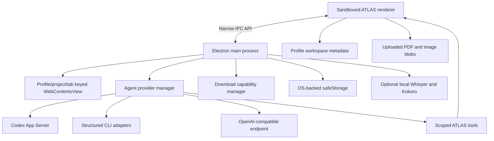

# ATLAS architecture

ATLAS is an Electron desktop application that treats project context as a security and product boundary. The renderer owns workspace presentation and profile metadata; the Electron main process owns native browser views, provider processes, downloads, permissions, and encrypted secrets.

## Runtime components

## Trust boundaries

### ATLAS shell and websites

The ATLAS shell loads from a loopback-only HTTP server. Websites render in separate native views rather than iframes. The preload bridge exposes a narrow API; renderer Node integration is disabled and context isolation and sandboxing are enabled.

### Profiles, projects, and tabs

Website sessions are partitioned per profile. Every live website view carries immutable profile, project, and tab identifiers. Switching projects hides inactive views without reassigning them, and deleting a tab or project destroys its corresponding view.

### Agent providers

Codex uses its native app-server protocol. Other CLIs use a structured, bounded tool loop; OpenAI-compatible endpoints use function calls. The provider receives only the context allowed by the current session scope. The bottom tray is always restricted to the selected project; all-project access is available only in the full Agent view.

### Downloads and Library files

Downloads remain in the operating system Downloads directory. The Library stores metadata and an exact file link. The agent cannot enumerate the Downloads directory and can read a linked file only after matching the active profile, project, and resource identifiers.

## Persistence

| Data | Location |
| --- | --- |
| Workspace metadata | Renderer local storage inside the Electron user-data directory |
| Uploaded PDFs and images | IndexedDB inside the Electron user-data directory |
| Website cookies and site storage | Per-profile persistent Electron session partitions |
| OpenAI-compatible keys | Encrypted `agent-secrets.json` inside user data |
| Downloads | Operating-system Downloads directory |
| Temporary voice recordings | Operating-system temporary directory, removed after transcription |

The repository and packaged application contain no user-data directory. `ATLAS_USER_DATA_DIR` provides a clean isolation boundary for development and verification.

## Change rules

Changes that touch IPC, browser-view identity, provider tools, permissions, downloads, or persistence require focused tests and a clean-profile run. New tools should be narrow, schema-validated, scope-aware, and incapable of arbitrary filesystem enumeration or renderer code execution.
